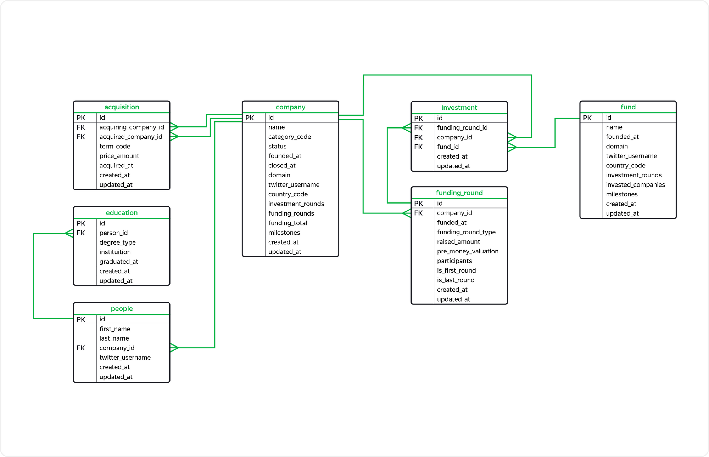

# Basic SQL
The database stores information about venture funds and investments in startup companies. This database is based on the [Startup Investments](https://www.kaggle.com/datasets/justinas/startup-investments) dataset published on the popular data mining competition platform Kaggle.

##Table of contents:

- primary key id - identifier or unique purchase number;
- foreign key acquiring_company_id - refers to the company table - the identifier of the acquiring company, that is, the one that buys another company;
- foreign key acquired_company_id - refers to the company table - the identifier of the company that is being purchased;
- term_code — transaction payment method:
	- cash - in cash;
	- stock - company shares;
	- cash_and_stock - mixed.
- price_amount — purchase amount in dollars;
- acquired_at — transaction date;
- created_at — date and time of creation of a record in the table;
- updated_at — date and time the record in the table was updated.

**company**
Contains information about startup companies.

- primary key id - identifier, or unique company number;
- name — company name;
- category_code — category of the company’s activity, for example:
	- news - specializes in working with news;
	- social - specializes in social work.
- status — company status:
	- acquired - acquired;
	- operating - operates;
	- ipo - went to IPO;
	- closed - ceased to exist.
- founded_at — date of foundation of the company;
- closed_at — company closing date, which is indicated if the company no longer exists;
- domain — domain of the company website;
- twitter_username — the name of the company’s Twitter profile;
- country_code — country code, for example, USA for the USA, GBR for the UK;
- investment_rounds — the number of rounds in which the company participated as an investor;
- funding_rounds — the number of rounds in which the company attracted investments;
- funding_total — the amount of attracted investments in dollars;
- milestones — the number of important stages in the company’s history;
- created_at — date and time of creation of a record in the table;
- updated_at — date and time the record in the table was updated.

**education**
Stores information about the educational level of company employees.

- primary key id - unique record number with information about education;
- foreign key person_id - refers to the people table - identifier of the person whose information is presented in the record;
- degree_type — academic degree, for example:
	- BA - Bachelor of Arts
	- MS - Master of Scienc
- instituition - educational institution, name of the university;
- graduated_at — date of completion of training, graduation;
- created_at — date and time of creation of a record in the table;
- updated_at — date and time the record in the table was updated.

**fund**
Stores information about venture funds.

- primary key id - unique number of the venture fund;
- name — name of the venture fund;
- founded_at — fund foundation date;
- domain — domain of the fund’s website;
- twitter_username — fund’s Twitter profile;
- country_code — fund country code;
- investment_rounds — the number of investment rounds in which the fund took part;
- invested_companies — the number of companies in which the fund has invested;
- milestones — the number of important stages in the fund’s history;
- created_at — date and time of creation of a record in the table;
- updated_at — date and time the record in the table was updated.

**funding_round**
Contains information about investment rounds.

- primary key id - unique number of the investment round;
- foreign key company_id - refers to the company table - a unique number of the company that participated in the investment round;
- funded_at — date of the round;
- funding_round_type — type of investment round, for example:
	- venture - venture round;
	- angel - angel round;
	- series_a — round A.
- raised_amount — the amount of investment that the company raised in this round in dollars;
- pre_money_valuation — preliminary assessment of the company’s value in dollars, carried out before investment;
- participants — number of participants in the investment round;
- is_first_round — whether this round is the first for the company;
- is_last_round — whether this round is the last for the company;
- created_at — date and time of creation of a record in the table;
- updated_at — date and time the record in the table was updated.

**investment**
Contains information about investments of venture funds in startup companies.

- primary key id - unique investment number;
- foreign key funding_round_id - refers to the table funding_round - unique number of the investment round;
- foreign key company_id - refers to the company table - the unique number of the startup company in which they invest;
- foreign key fund_id - refers to the fund table - the unique number of the fund investing in the startup company;
- created_at — date and time of creation of a record in the table;
- updated_at — date and time the record in the table was updated.